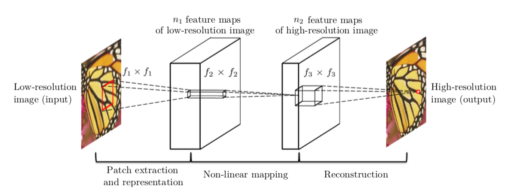

# yemen-bombings-tracking
Projet de tracage et de detections de bombardements au Yemen grâce a des images satelittes méné par [BETTINGER Matthieu](), [HAFID Salim]() et [SADER Bruno]() pour Handicap International en colaboration avec La Fondation INSA

# Sommaire
## Architecture d'augmentation et de detection des bombardements grâce à Sentinel
### Sentinel
Sentinel est un groupe de satelittes gratuitement accessible de Agence spatiale européenne.
Les satelittes les plus precis sont les Sentinel-2A/B pour la qualité d'image et le Sentinel 5p pour les parametres atmospheriques (O3, CH4, NO2 etc...)

#### Le module **fetcher** est utilisé pour obtenir les données du satellite Sentinel-2.

*--api-file* : utilisé pour initialiser la connexion avec l'API sentinelsat avec un fichier json contenant "user" et "pass". Par défaut, utilise le document appelé SentinelAPIUser.json.<br>
*--district-file* : json contenant une liste de tous les districts (dans notre cas tous les districts du Yémen) et leur polygone correspondant.<br>
*--district-name* : nécessaire pour récupérer les informations d'un district particulier.<br>
*--start-date* : format ddmmYYYY<br>
*--end-date* : format ddmmYYYY<br>
*--level* : utilisé pour indiquer le type de produit que nous recherchons. Par défaut, le niveau est 1C (type de produit S2MSI1C) mais le niveau peut être 2A (S2MSI2A)<br>

La doc sentinelsat peut etre trouvé sur https://sentinelsat.readthedocs.io/en/stable/.

#### Le module **processor** est utilisé afin de traiter les images obtenues grace au fetcher.

la fonction ```process_products(unprocessed_path, processed_path, best_product)``` prend en entrée trois parametres:
1. *unprocessed_path*: qui est le chemin vers les images non traitées
2. *processed_path*: qui est le chemin vers le dossier ou non souhaitons sauvegarder l'image traité
3. *best_product*: est le meilleur produit (ayant une couverture nuagueuse minimale)

Cette fonction sert a combiner les 3 bandes de couleurs (Rouge/Vert/Bleu) en une seule image .tiff (ce format est choisi car il ne compresse pas l'image). Cependant l'image etant trop grosse, il l'a coupe en 4 images de tailles identiques (```split_into_tiles``` du module utils) afin d'avoir des images plus facilement manipulables.

Ce module utilise les meme arguments que fetcher

#### Le module utils contient toutes les fonctiones annexes utiles aux modules

### Augmentation d'image

#### Le module **prepare**
#### Le module **datasets**
#### Le module **model**

##### SRCNN
<center></center>

#### Les module **train** et **test**
#### Le module **augment**

### Detection des bombardements
### Architecture
## Detection et comparaison d'images 
## Axes d'ameliorations et de recherches
