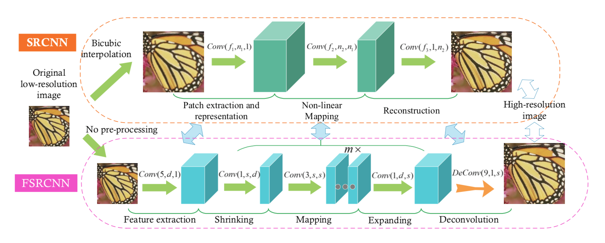

# yemen-bombings-tracking
Projet de tracage et de detections de bombardements au Yemen grâce a des images satelittes méné par [BETTINGER Matthieu](), [HAFID Salim]() et [SADER Bruno]() pour Handicap International en colaboration avec La Fondation INSA.

# Sommaire
## Architecture d'augmentation et de detection des bombardements grâce à Sentinel
### Sentinel
Sentinel est un groupe de satelittes gratuitement accessible de Agence spatiale européenne.
Les satelittes les plus precis sont les Sentinel-2A/B pour la qualité d'image et le Sentinel 5p pour les parametres atmospheriques (O3, CH4, NO2 etc...)

#### Le module **fetcher** est utilisé pour obtenir les données du satellite Sentinel-2.

*--api-file* : utilisé pour initialiser la connexion avec l'API sentinelsat avec un fichier json contenant "user" et "pass". Par défaut, utilise le document appelé SentinelAPIUser.json.<br>
*--district-file* : json contenant une liste de tous les districts (dans notre cas tous les districts du Yémen) et leur polygone correspondant.<br>
*--district-name* : nécessaire pour récupérer les informations d'un district particulier.<br>
*--start-date* : format ddmmYYYY<br>
*--end-date* : format ddmmYYYY<br>
*--level* : utilisé pour indiquer le type de produit que nous recherchons. Par défaut, le niveau est 1C (type de produit S2MSI1C) mais le niveau peut être 2A (S2MSI2A)<br>

La doc sentinelsat peut etre trouvé sur https://sentinelsat.readthedocs.io/en/stable/.

#### Le module **processor** est utilisé afin de traiter les images obtenues grace au fetcher.

la fonction ```process_products(unprocessed_path, processed_path, best_product)``` prend en entrée trois parametres:
1. *unprocessed_path*: qui est le chemin vers les images non traitées
2. *processed_path*: qui est le chemin vers le dossier ou non souhaitons sauvegarder l'image traité
3. *best_product*: est le meilleur produit (ayant une couverture nuagueuse minimale)

Cette fonction sert a combiner les 3 bandes de couleurs (Rouge/Vert/Bleu) en une seule image .tiff (ce format est choisi car il ne compresse pas l'image). Cependant l'image etant trop grosse, il l'a coupe en 4 images de tailles identiques (```split_into_tiles``` du module utils) afin d'avoir des images plus facilement manipulables.

Ce module utilise les meme arguments que fetcher

#### Le module utils contient toutes les fonctiones annexes utiles aux modules

### Augmentation d'image

L'augmentation d'image est un processus visant à ameliorer la qualité d'une image source. Les images Sentinel etant de trop "basse" qualité ($10m^2$), l'augmentation aurait permit au model de detection de mieux fonctionner.

#### Le module **prepare**
Ce module est un peu particulier car il est utilisé en amont afin de preparer nos données sous un format specifique utilisable par nos modeles.<br>
Les images sont donc traitées selon la litterature (["Image Super-Resolution Using Deep Convolutional Networks"](https://arxiv.org/abs/1501.00092) pour le SRCNN par exemple) et stockées dans un fichier hdf5 (ce fichier permettant ensuite de plus facilement utiliser les images traitées et de les partager avec une vm ou un serveur).<br>
Les images sont traitées de la maniere suivante: 
- une image dites hr (haute resolution)
- une image lr (low resolution) qui est l'image hr reduite d'un facteur X (parametre *--scale*) grâce à une interpolation bicubique.

*--images-dir* : est le chemin vers le dossier qui contient les images qu'on souhaite preparer (le chemin du parametre processed_path).<br>
*--output-dir* : est le chemin vers le fihcier hdf5 que nous souhaitons créer (ex. "data_out.h5").<br>
*--model* : est un parametre qui permet d'indiquer pour quel model nous traitons les données.<br>
*--eval* : est un parametre qui permet d'indiquer si nous preparons l'image à etre testée.<br>
*--scale* : est un parametre qui permet d'indiquer quel est la diminution de resolution souhaitée.<br>

#### Le module **datasets**

Le module dataset permet de transformer le fichier hdf5 en un object pytorch ([Dataset](https://pytorch.org/docs/stable/data.html#torch.utils.data.Dataset)) interpretable par notre model (util pour l'apprentissage et l'évaluation)

#### Le module **model**

Le module contient les differents modeles testés lors du developement<br>
Les 3 modeles qui sont integrés sont:

-  SRCNN<br>
Model implementé selon ["Image Super-Resolution Using Deep Convolutional Networks"](https://arxiv.org/abs/1501.00092) et grace au [dépôt git](https://github.com/yjn870/SRCNN-pytorch/)<br>
   <center></center>

-  FSRCNN<br>
Model implementé selon ["Accelerating the Super-Resolution Convolutional Neural Network"](https://arxiv.org/abs/1608.00367) et grace au [dépôt git](https://github.com/yjn870/FSRCNN-pytorch/)<br>
<center></center>

-  SubPixel<br>
Model implémenté selon ["Guided Super-Resolution as Pixel-to-Pixel Transformation"](https://arxiv.org/abs/1904.01501) et grace au [dépôt git](https://github.com/riccardodelutio/PixTransform).<br>
Ce model permet d'appliqué l'information d'une image lr à une image hr afin d'avoir une image de bonne qualité avec les informations supplémentaires.<br>
<center></center>

#### Les modules **train** et **test**

- Le module train<br>
Le module sert, comme son nom l'indique, à entrainer nos modeles.<br>
*--train-file* : est le chemin vers le fichier hdf5 d'entrainement <br>
*--val-file* : est le chemin vers le fichier hdf5 de validation <br>
*--output-dir* : est le chemin vers le dossier ou nous souhaitons sauvegarder les poids du model<br>
*--scale* : est le facteur d'augmentation<br>
*--lr* : est le learning rate<br>
*--batch-size* : est la taille de chaque batch<br>
*--model* : permet d'indiquer le model qu'on souhaite entrainer<br>
*--num-epochs* : est le nombre d'epoch sur lesquels nous souhaitons entrainer<br>

L'entrainement du model est fait grace à des images Google Earth (hr) qui sont reduites afin d'avoir la meme image de basse qualité. Nous entrainons donc le model à recreer l'image de base en partant de l'image lr. Afin d'evaluer le model nous utilisons comme métrique le PSNR (Peak Signal to Noise Ratio) qui est défini par la formule suivante :<br>
PSNR = *10*$\times$$log_{10}$$\frac{d^2}{EQM}$ avec EQM l'erreur quadratique moyenne, et $d^2$ la dynamique du signal (la valeur maximum possible pour un pixel).

- Le module test<br>

#### Le module **augment**
### Detection des bombardements
### Architecture
### Requirements

- PyTorch
- Numpy
- h5py
- tqdm
- etc
  
## Detection et comparaison d'images 
## Axes d'ameliorations et de recherches

